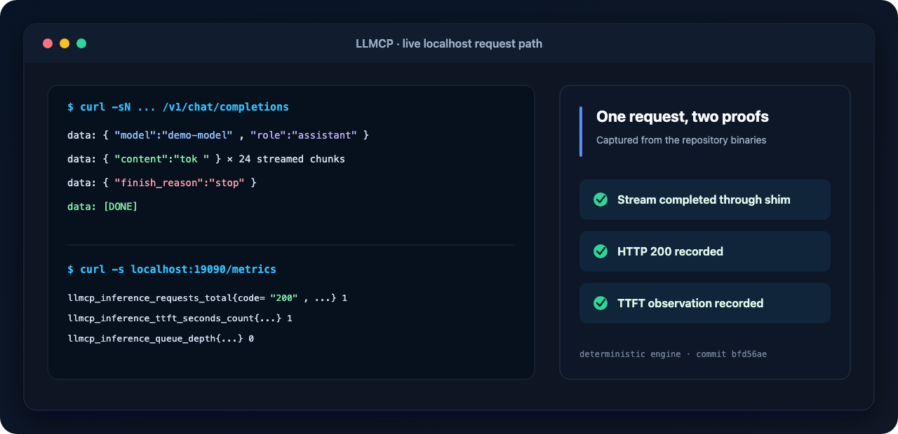
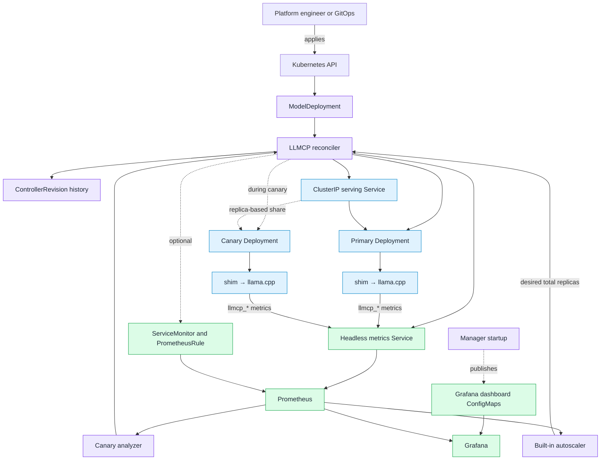
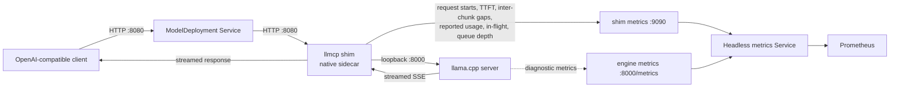
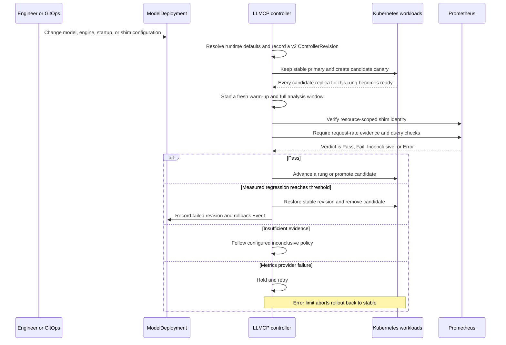
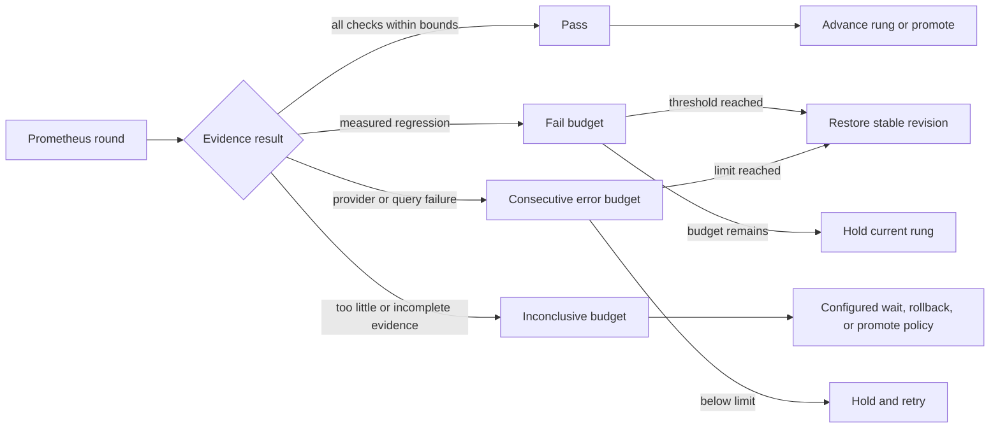
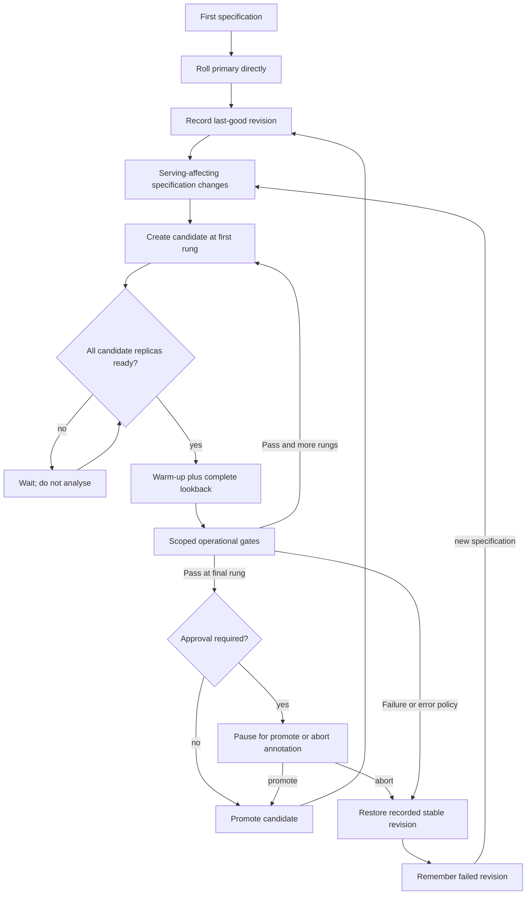
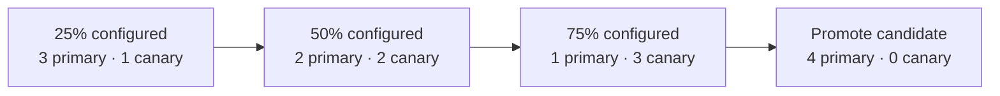
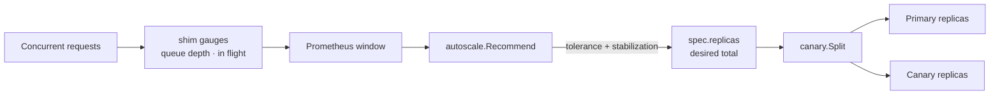
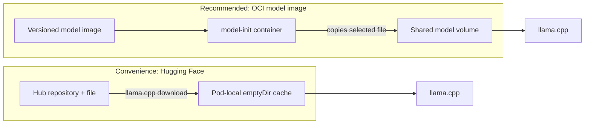

<div align="center">

# LLM Inference Control Plane

### Operationally safe rollouts and demand-aware scaling for self-hosted LLM inference on Kubernetes

[](https://github.com/surajm20061998/LLM_Inference_Control_Plane/actions/workflows/test.yml)
[](https://github.com/surajm20061998/LLM_Inference_Control_Plane/actions/workflows/test-e2e.yml)
[](https://github.com/surajm20061998/LLM_Inference_Control_Plane/actions/workflows/lint.yml)
[](LICENSE)


LLMCP turns one `ModelDeployment` into an OpenAI-compatible inference service, then watches the signals Kubernetes readiness cannot see: time to first token, errors, request pressure, and queueing. A candidate can remain healthy and return HTTP 200 while becoming much slower; LLMCP can detect that regression and restore the last known-good revision.

[Quick start](#five-minute-quick-start) · [Architecture](#architecture) · [Canary workflow](#how-a-canary-decision-is-made) · [Use cases](#where-it-fits) · [Metrics](docs/metrics.md) · [Current scope](#current-scope-and-limitations) · [Demo guide](docs/demo.md) · [API reference](docs/api.md)

</div>

> [!IMPORTANT]
> **Safety here means operational rollout safety.** Built-in gates cover latency, HTTP errors, traffic evidence, queueing, and throughput. LLMCP does not currently judge factuality, hallucination, toxicity, or other semantic properties of model output.



<p align="center"><sub>Reproduced from the repository's deterministic engine and shim binaries. The fake engine makes timing repeatable; the request proxy and exported metrics are the production code path.</sub></p>

## Why this exists

A Kubernetes Deployment can tell whether a new pod starts and stays ready. It cannot tell whether a model upgrade, engine change, or resource adjustment made inference noticeably worse for users.

LLMCP adds that missing control loop:

1. keep the last known-good revision serving;
2. start the candidate beside it;
3. collect comparable, engine-independent request metrics;
4. require enough traffic to make a decision;
5. advance, pause, promote, or roll back from measured evidence.

The key user-facing signal is **time to first token (TTFT)**. It captures how long an interactive caller waits before a streamed response begins, without confusing longer requested outputs with a slower service.

## Where it fits

| Team | Situation | What LLMCP provides |
|---|---|---|
| **Platform engineering** | Offer a private, OpenAI-compatible model endpoint on an existing Kubernetes platform | One namespaced resource owns the model source, llama.cpp runtime, Service, rollout policy, metrics, and status. |
| **SRE / ML infrastructure** | Release new model weights, an engine image, context settings, or resource limits | A stable/candidate rollout with TTFT and error gates, sticky failed-revision state, automatic rollback, and an auditable Kubernetes Event. |
| **Capacity engineering** | Inference begins queueing before CPU becomes an actionable signal | A built-in queue-depth or concurrency autoscaler that changes the total fleet size while rollout logic decides how that capacity is split. |
| **Release governance** | Promotion needs an operator checkpoint | An optional final approval gate using the `llmcp.io/promote` annotation, plus an explicit abort control. |

These scenarios map directly to the [`ModelDeployment` API](api/v1alpha1/modeldeployment_types.go), the [canary state machine](internal/canary/state.go), the [autoscaling recommendation core](internal/autoscale/recommend.go), and the [generated observability resources](internal/controller/observability.go).

## Architecture

The controller uses ordinary Kubernetes resources and keeps the request path separate from the decision path.



The reconciliation order is visible in [`ModelDeploymentReconciler.Reconcile`](internal/controller/modeldeployment_controller.go): validate the resource, resolve or safely adopt its revision identity, record new history, sample autoscaling, compute the rollout plan, apply child resources, reconcile observability, then publish status and Events. Dashboards are operator-wide assets published once when the [manager starts](cmd/main.go); per-deployment `ServiceMonitor` and `PrometheusRule` resources are reconciled continuously.

### Request and telemetry path

Every inference request passes through the shim before it reaches the engine. The public Service does not expose the engine port directly.



The [`cmd/shim`](cmd/shim) reverse proxy measures streaming responses and exports the canonical `llmcp_*` metrics used by analysis and autoscaling. Every workload series carries `namespace`, `model_deployment`, `model`, and `variant`; automated queries use the first two as resource identity and deliberately do not fall back to legacy model-only data. It is rendered as a [Kubernetes native sidecar](internal/controller/shim.go), so readiness includes the measurement path. The exact telemetry semantics are documented in [Metrics and decision evidence](docs/metrics.md).

## How a canary decision is made



The analyzer deliberately distinguishes four outcomes:

| Verdict | Meaning | Default rollout behavior |
|---|---|---|
| `Pass` | Every configured check passed with sufficient traffic | Advance or promote. |
| `Fail` | A measured value breached its threshold | Increment the failed-check budget; roll back at the threshold. |
| `Inconclusive` | There was not enough evidence, commonly too little traffic | Track separately and follow the configured wait/rollback/promote policy. |
| `Error` | Prometheus could not provide a valid measurement | Never count it as evidence that the release is bad; hold initially and abort safely to the stable revision at the consecutive-error limit. |

This behavior is implemented in [`analysis.Analyzer`](internal/analysis/analyzer.go), [`analysis.Evaluate`](internal/analysis/evaluate.go), and the pure [`canary.Next`](internal/canary/state.go) state transition function.

The four results deliberately use three separate budgets:



Provider/schema readiness is checked before this classification. A pinned legacy shim or incomplete resource-scoped window holds the candidate under `MetricScopeReady=False` without spending any of the three decision budgets.

### Release lifecycle and restart safety



The position, counters, readiness target, metric-schema handshake, and rollback identities live in status rather than controller memory. Leader changes and manager restarts therefore resume the same rollout. Versioned history freezes effective runtime images and defaults, while legacy revision bytes remain decodable by their stored identity. A steady equivalent legacy workload is adopted without inventing a release; a legacy rollout using the old telemetry shape is held unchanged with an explicit abort instruction instead of being restarted under a new hash. Missing or contradictory history fails closed. The wire contract and upgrade behavior are documented in [ADR 0008](docs/adr/0008-versioned-workload-revisions.md).

### Traffic exposure today

The implemented `Replica` routing mode puts both variants behind one Service and approximates exposure from their replica counts. With four total replicas, the representable configured shares are 25%, 50%, and 75%:



`status.canary.currentWeight` is this configured pod ratio, not a measurement of request distribution. Kubernetes balances connections, and clients may reuse them. Once a complete request-start window exists, `status.canary.observedWeight` reports the measured share with its timestamp, window, and an explicit reason when evidence is missing or stale. That observation is display-only: rollout gates still compare operational quality rather than trying to steer from a noisy short-window percentage. Exact request-level weights require a routing layer such as Gateway API; that is [planned, not implemented](improvement_plan.md#request-weighted-routing-with-gateway-api).

## Demand-aware autoscaling

The built-in autoscaler and canary controller have separate responsibilities: autoscaling chooses **how much total capacity exists**; rollout logic chooses **how that capacity is divided**.



Queue depth answers a direct operational question: are requests waiting because all configured engine slots are busy? The recommendation function applies a dead band and asymmetric stabilization before changing `.spec.replicas`. An external HPA can instead target the same `/scale` subresource when built-in autoscaling is disabled.

## Model delivery



OCI delivery is deterministic, cacheable by the container runtime, and usable offline. Hugging Face delivery is convenient for exploration but each new pod downloads into ephemeral storage. The model-source rendering is in [`buildModelDelivery`](internal/controller/children.go); PVC delivery is represented in the API but is not implemented by the llama.cpp profile.

## Five-minute quick start

The fastest path uses the deterministic fake engine. It exercises the real llama.cpp profile, generated workloads, native shim, Service, status, and request path without downloading a model.

### Prerequisites

- Docker Desktop or another Docker-compatible runtime
- `kubectl`, [kind](https://kind.sigs.k8s.io/), GNU Make, and Go 1.26+
- approximately 4 CPU cores and 6 GiB available to Docker for the basic demo

```bash
# Create a three-node cluster with its local image registry.
make kind-up

# Build the controller, shim, deterministic engine, and placeholder model;
# install the CRD; and deploy the controller.
make dev-deploy

# Create a two-replica OpenAI-compatible inference service.
kubectl apply -f config/samples/inference_v1alpha1_modeldeployment.yaml
kubectl wait modeldeployment/demo --for=condition=Ready --timeout=300s
kubectl get modeldeployment,deployments,pods,services
```

Send a streaming request from inside the cluster:

```bash
kubectl run llmcp-client --rm -i --restart=Never \
  --image=curlimages/curl:8.11.1 -- \
  curl -sN -H 'Content-Type: application/json' \
  -d '{"model":"demo-model","stream":true,"messages":[{"role":"user","content":"Explain a Kubernetes operator in one sentence."}]}' \
  http://demo.default.svc:8080/v1/chat/completions
```

For the full Prometheus-backed rollback demonstration:

```bash
make loadgen-image
make monitoring-install
make e2e-chainsaw SUITE=04-canary-rollback
```

See the [guided demo](docs/demo.md) for the real Qwen3 path, Grafana dashboards, canary failure injection, autoscaling, and cleanup.

## A `ModelDeployment` at a glance

```yaml
apiVersion: inference.llmcp.io/v1alpha1
kind: ModelDeployment
metadata:
  name: private-chat
spec:
  replicas: 4
  model:
    name: qwen3-0.6b
    source:
      image:
        image: registry.example.com/models/qwen3-0.6b:q4km
        path: /weights/model.gguf
  engine:
    type: llamacpp
    maxConcurrency: 4
    resources:
      requests: {cpu: "1", memory: 1Gi}
      limits: {cpu: "2", memory: 2Gi}
  rollout:
    type: Canary
    canary:
      stepWeights: [25, 50, 75]
      trafficRouting: {mode: Replica}
      analysis:
        minRequestRate: "500m"
        provider:
          type: Prometheus
          address: http://prometheus-operated.monitoring.svc:9090
        metrics:
          - name: ttft-regression
            builtin: ttft-p95
            compareToPrimary: true
            thresholdRange: {max: "1500m"}
```

The full field reference is generated from the Go API types in [`docs/api.md`](docs/api.md). Production examples should pin image digests and configure credentials through Secrets.

## Observability built in

When the corresponding CRDs are installed, each `ModelDeployment` can own:

- a `ServiceMonitor` for shim and optional engine metrics;
- a `PrometheusRule` containing TTFT and availability recording rules;
- multi-window burn-rate alerts plus a no-traffic alert;
- three embedded Grafana dashboards: **Control Plane**, **Canary**, and **Inference SLO**.

The controller periodically rechecks optional monitoring discovery and repairs its owned monitoring children after deletion or drift. Apply failures are surfaced as `MetricsRegistered=False`; they no longer report a false success. The SLO model and operational response are documented in the [SLO runbook](docs/slo.md). Dashboard definitions are versioned with the controller under [`internal/observability/dashboards`](internal/observability/dashboards).

## Current scope and limitations

LLMCP is an early `v1alpha1` project. Its current boundary is explicit:

| Capability | Current state |
|---|---|
| Inference engine | **Implemented:** llama.cpp. The deterministic fake engine is test infrastructure, not a public engine type. |
| Model sources | **Implemented:** OCI image and Hugging Face download. **Not implemented:** PVC mount and persistent Hub cache. |
| Service exposure | **Implemented:** in-cluster `ClusterIP`. **Not implemented:** public ingress or Gateway ownership. |
| Canary routing | **Implemented:** approximate replica-based distribution behind one Service. **Not implemented:** exact request-level weights. |
| Safety signals | **Implemented:** operational Prometheus metrics and custom PromQL. **Not implemented:** semantic evaluation or shadow traffic. |
| Metric identity | **Implemented:** built-in decisions, recording rules, alerts, and dashboards are isolated by namespace and ModelDeployment name. This is metric isolation, not an authorization or multi-tenant security boundary; custom PromQL must use the documented identity variables. |
| Stream throughput | **Implemented:** content-chunk rate and explicit server-reported output-token rate with a configurable usage-sample floor. Missing usage is not estimated. Deprecated `output_tokens`/TPOT series retain their original chunk-based approximation for compatibility only. |
| Rollback history | **Implemented:** v2 workload snapshots freeze effective engine/shim images, startup timeout, and derived runtime defaults; legacy identities are adopted only from matching stored and live evidence. Active pre-migration telemetry is held for an explicit abort rather than silently restarted. |
| Autoscaling | Minimum one replica. Scale-to-zero needs an always-available activation/request layer and is not implemented. |
| Workload placement | Generic resource requests/limits are supported; first-class GPU scheduling, affinity, tolerations, and topology controls are not. |
| Prometheus access | Address and timeout are supported; authenticated and custom-TLS providers are not. |

The researched implementation sequence is maintained in [`improvement_plan.md`](improvement_plan.md). Planned features are intentionally not presented as current product behavior.

## Design documentation

| Document | Question answered |
|---|---|
| [Demo guide](docs/demo.md) | How can I demonstrate serving, metrics, rollback, autoscaling, and SLOs? |
| [API reference](docs/api.md) | What does every CRD field mean? |
| [SLO runbook](docs/slo.md) | How are the generated alerts calculated and handled? |
| [Metrics contract](docs/metrics.md) | What does each shim metric measure, and how are decisions isolated? |
| [Improvement execution status](docs/implementation-status.md) | Which researched changes are implemented and which release gates remain? |
| [ADR 0001](docs/adr/0001-spike-closed-loop.md) | What did the feasibility spike measure? |
| [ADR 0002](docs/adr/0002-model-weight-delivery.md) | Why package production model weights separately? |
| [ADR 0003](docs/adr/0003-metrics-shim.md) | Why is a reverse-proxy sidecar necessary? |
| [ADR 0004](docs/adr/0004-canary-analysis.md) | Why are there four analysis verdicts? |
| [ADR 0005](docs/adr/0005-autoscaling.md) | How is total capacity calculated and owned? |
| [ADR 0006](docs/adr/0006-slo-and-dashboards.md) | Why use TTFT and burn-rate alerts? |
| [ADR 0007](docs/adr/0007-hardening-and-ci.md) | Which invariants are enforced by CI and lint? |
| [ADR 0008](docs/adr/0008-versioned-workload-revisions.md) | Which fields define a restorable workload revision? |

## Development and verification

```bash
make test              # unit tests plus envtest API-server integration
make lint              # static analysis
make docs-mermaid-check # render every README Mermaid diagram with the pinned parser
make chainsaw-lint     # validate real-cluster suite definitions
make e2e-up            # local kind cluster, images, and controller
make e2e-chainsaw      # standard real-cluster behavior suites
make e2e-observability-resync # destructive optional-API test; dedicated cluster only
make verify            # all checks that do not require an existing cluster
```

The tiers prove different things: unit tests exercise the pure decision cores; envtest verifies API machinery and reconciliation against a real API server and etcd; [Chainsaw suites](test/chainsaw) verify pods, Services, `/scale`, a stock HPA, and full-cluster behavior.

## License

Licensed under the [Apache License 2.0](LICENSE).
